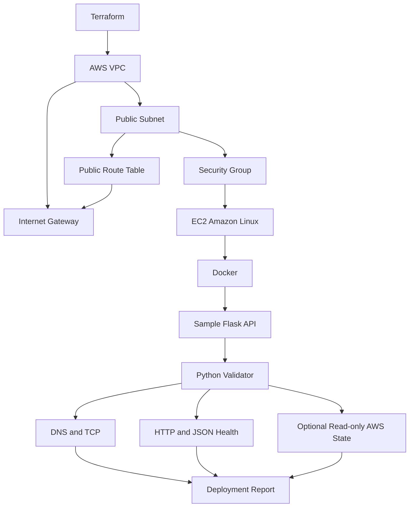

# Automated Cloud Infrastructure Deployment & Validation

This project uses Terraform to provision a minimal AWS environment, bootstraps a containerized application on Linux, and uses Python to automatically validate the deployment across infrastructure, network, and application layers.

> **AWS cost warning:** Terraform configuration in this repository creates billable AWS resources. Nothing is deployed automatically. Review the selected account, region, complete plan, and current AWS pricing before applying; destroy the demonstration promptly afterward.

## Problem

Manual infrastructure deployment verification is slow and error-prone. A reachable instance does not prove that routing, port exposure, the container, HTTP endpoint, and application health are all working as intended.

## Solution

Terraform defines a small, reviewable environment. EC2 user data installs Docker and starts the sample service. The Python validator then checks each dependency in order—configuration, DNS, TCP, HTTP status, and health payload—and produces targeted diagnostics at the layer where validation stops.

## Architecture



Network responsibilities:

- The **VPC** provides an isolated address space and DNS support.
- The **public subnet** places the single instance on a network that can route to the internet and assigns a public IPv4 address.
- The **Internet Gateway** connects the VPC to the public internet.
- The **route table** sends `0.0.0.0/0` traffic through that gateway.
- The **security group** allows only the configured application port publicly. SSH is disabled by default; if enabled, Terraform rejects `0.0.0.0/0` and requires a restricted CIDR.

## Features

- Minimal VPC, subnet, route, security group, and one EC2 instance
- Current Amazon Linux 2023 AMI lookup instead of a hard-coded regional AMI
- Encrypted 8 GiB gp3 root volume and IMDSv2 requirement
- Dockerized Flask service with `/` and `/health`
- DNS, TCP, HTTP status, JSON payload, and response-time validation
- Terraform output ingestion with manual-host fallback
- Optional read-only EC2 state, project-tag, and security-group validation
- `PASS`, `WARNING`, `FAIL`, and `SKIPPED` states
- Layer-aware diagnostics separating observations from possible investigation areas
- JSON reports and rotating logs for automation
- Eighteen offline tests with mocked network, HTTP, Terraform, and AWS behavior
- Safe plan-only deployment helper and confirmation-gated destroy helper
- GitHub Actions tests, Docker build, Terraform format check, and validation

## Repository Structure

```text
.
├── app/                    # Flask service and container image
├── infrastructure/         # Terraform AWS resources and EC2 user data
├── scripts/                # Plan, validate, and guarded destroy helpers
├── tests/                  # Fully offline pytest suite
├── validator/              # Layered validation and diagnostics package
├── validate.py             # Validator CLI
├── requirements.txt        # Core local dependencies
└── requirements-aws.txt    # Optional boto3 extra
```

## Local Demo

The complete deployment-validation workflow can be demonstrated for $0 without AWS:

```bash
python3 -m venv .venv
source .venv/bin/activate
python -m pip install -r requirements.txt

docker build -t deployment-demo ./app
docker run --rm -p 8080:8080 deployment-demo
```

In a second terminal:

```bash
source .venv/bin/activate
python validate.py --host localhost --port 8080
```

Expected result:

```text
NETWORK
DNS Resolution             4 ms                 PASS
TCP :8080                  0 ms                 PASS

APPLICATION
GET /health                200 / 49 ms          PASS
Health Payload             healthy              PASS

DEPLOYMENT STATUS: PASSED
```

Timings vary by machine.

### Intentional Failure Demo

With nothing listening on port `9999`:

```bash
python validate.py --host localhost --port 9999 --timeout 1
```

The command exits with status `1`, marks TCP as `FAIL`, skips HTTP because it is blocked by the failed dependency, and suggests checking instance state, security rules, routing, listeners, Docker port publishing, and host firewall.

## AWS Deployment

### Prerequisites

- Terraform 1.6 or newer
- An explicitly selected AWS account and region
- Standard AWS provider credentials with permissions for the declared resources
- Permission to review and accept AWS charges

Do not put access keys in Terraform files. Confirm the active credentials outside this project and edit `terraform.tfvars` before planning:

```bash
cd infrastructure
cp terraform.tfvars.example terraform.tfvars
# Review aws_region, instance_type, CIDRs, and every other value.
terraform init
terraform fmt -check
terraform validate
terraform plan -out=tfplan
terraform show tfplan
```

The helper performs the same safe preparation and stops before creation:

```bash
./scripts/deploy.sh
```

Only after explicit approval of the account, region, plan, and cost:

```bash
terraform -chdir=infrastructure apply tfplan
```

No `apply` is performed by CI or by the plan helper.

## Validation

After an approved apply, Terraform exposes the instance ID, public IP, application port, application URL, health URL, region, and expected project tag.

```bash
python validate.py --terraform-dir infrastructure
```

JSON for CI/CD integration:

```bash
python validate.py --terraform-dir infrastructure --json
```

Manual target validation works without Terraform or AWS credentials:

```bash
python validate.py --host 203.0.113.10 --port 80
```

Optional AWS checks require `boto3` and read-only EC2 access:

```bash
python -m pip install -r requirements-aws.txt
python validate.py --terraform-dir infrastructure --aws
```

The `--aws` flag only calls `DescribeInstances`; it is not required for DNS, TCP, or HTTP validation.

## Failure Diagnostics

Checks execute in dependency order:

- DNS failure leaves TCP and HTTP `SKIPPED`; it does not claim the application is unhealthy.
- DNS success followed by TCP failure focuses on the instance, routes, Internet Gateway, security group, listener, Docker mapping, and host firewall.
- TCP success followed by HTTP failure records that network connectivity exists and focuses on the application, endpoint, logs, and HTTP configuration.
- HTTP success with an invalid health payload focuses on the application health contract and readiness.

Reports label findings as **observed facts** and remediation paths as **possible investigation areas**. `validator/diagnostics.py` also produces structured incident context suitable for a future local Ollama model or enterprise incident tool; AI is not used or required.

## Testing

```bash
pytest -q
terraform -chdir=infrastructure fmt -check
terraform -chdir=infrastructure validate
```

Tests do not require AWS credentials, public internet access, or running infrastructure. Network sockets, HTTP responses, Terraform output, and AWS responses are mocked.

## CI/CD

On pushes and pull requests, GitHub Actions:

1. installs Python dependencies;
2. runs the offline pytest suite;
3. builds the sample Docker image;
4. checks Terraform formatting;
5. initializes the provider without a backend; and
6. validates the Terraform configuration.

CI never runs `terraform plan`, `apply`, or `destroy` and does not require AWS credentials.

## Security

- AWS credentials use the standard provider chain and are never stored here.
- Terraform state, local variable files, private keys, logs, and virtual environments are ignored.
- `.terraform.lock.hcl` is committed for reproducible provider selection.
- SSH is disabled unless both a restricted administrative CIDR and existing key-pair name are configured.
- Only the application port is public by default.
- The root EBS volume is encrypted, and EC2 metadata requires IMDSv2 tokens.
- The container runs as an unprivileged user.
- Optional AWS validation performs read-only instance description.

## Cost Controls

The design intentionally uses:

- one configurable `t3.micro` instance by default;
- one 8 GiB gp3 root volume;
- one automatically assigned public IPv4 address, not an Elastic IP;
- no NAT Gateway, load balancer, database, container orchestration, or paid monitoring service.

Potential charges include EC2 runtime, gp3 storage while provisioned, the public IPv4 address, and any billable data transfer. AWS currently lists public IPv4 addresses at `$0.005` per hour; compute and storage pricing varies by region and account program. Do not assume the deployment is free. Check the [EC2 On-Demand pricing](https://aws.amazon.com/ec2/pricing/on-demand/), [EBS pricing](https://aws.amazon.com/ebs/pricing/), and [VPC public IPv4 pricing](https://aws.amazon.com/vpc/pricing/) immediately before deployment.

Destroy the demo as soon as validation is complete.

## Cleanup

Preview and explicitly confirm destruction:

```bash
./scripts/destroy.sh
```

Or run Terraform directly:

```bash
terraform -chdir=infrastructure plan -destroy
terraform -chdir=infrastructure destroy
```

Terraform only destroys resources tracked in the current state. Afterward, verify the selected AWS account and region for remaining EC2 instances, EBS volumes, public IPv4 addresses, security groups, and related VPC resources.

## Limitations

- TCP success does not prove application correctness.
- The HTTP health endpoint does not prove every application feature works.
- The public-IP architecture is intentionally simplified for a short-lived demo.
- There is no high availability or load balancing.
- There is no production secrets-management integration.
- There is no historical deployment database.
- User-data completion may take several minutes after EC2 first reports `running`.
- AWS API validation is optional and limited to instance state, tags, and attached security-group presence.

## Future Improvements

- Private subnets and managed ingress
- Load balancer and multi-instance deployments
- Remote Terraform state with locking
- Prometheus and CloudWatch metrics
- CI/CD deployment approval gates
- Integration with the Cloud Infrastructure Health Monitor project
- Optional AI-assisted incident analysis using the existing structured context


## License

MIT
